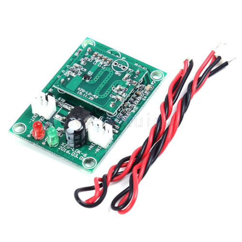

# Powersaving feature

At first I've implemeted the backlight PWM brightness feature. See 
This is great to reduce the brightness of the display during the night, especially because the radio is used as a bedside alarm clock.

But - it does not reduce the amount of used energy that much (max. 1 Watt). 

Power usage is about 4.7 watts when the Peppy player is in screensaver mode (clock display) including display at 100% brightness, amplifier (Innomaker RPI HiFi AMP HAT TAS5713 Amplifier Audio Module 25W) and Raspi Zero 2 W.

Way too much.

The used Waveshare "5inch HDMI LCD (H)" has a power button. The idea was to steer this button signal with a radar sensor to only switch the display on when someone is in the room and off after a while when leaving the room. 

When switching the display off with this button, it saves only about 1 watt power: 3.7 watts 

## The solution

When disconnecting the USB power supply/touchscreen interface between Raspi and Display, the power usage of the whole setup drops to 1.7 watts, minus 3 watts!

So I bought a radar sensor board with a MOSFET switch capable of switching up to 3A and a decent voltage range of 3.7-12V. This is placed in the +5V path of a USB-A male/female cable between Raspi and Display power supply/touchscreen USB.

### DC-SSR Switch Radar DC Microwave Sensor Switch Module

